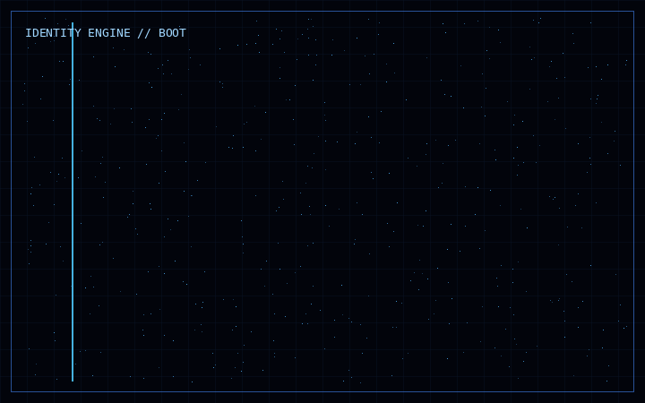

<div align="center">


<br><br>



</div>

---

<div align="center">

### `THE PROFILE IS LOADING...`

**Software Engineer · Computer Scientist · Technology Explorer**

*I don't just want to use technology. I want to understand what is underneath it.*

</div>


## `01` — SYSTEM IDENTITY

```console
[root@mainframe ~]$ ./fetch_user_data.sh

[+] ALIAS: Joy Oluomachukwu Anyi
[+] LOCATION: Nigeria
[+] SYSTEM_UPTIME: B.Sc. Computer Science
    Status: First Class (4.67/5.0)
    Graduated: June 20th
[+] CORE_ARCHITECTURE: Backend Engineering & Systems Programming
[+] AFFILIATIONS: Cowrywise Ambassador, Women in Tech
[+] CURRENT_MISSION: Learn technology from applications to systems,
                    AI, embedded computing, robotics and hardware.
```

---

## `02` — THE RABBIT HOLE

```text
APPLICATION
    ↓
FRAMEWORK
    ↓
LANGUAGE
    ↓
RUNTIME
    ↓
OPERATING SYSTEM
    ↓
CPU / MEMORY
    ↓
DIGITAL LOGIC
    ↓
PHYSICAL COMPUTATION
    ↓
ANOTHER QUESTION
```

Technology fascinates me because every abstraction hides another layer.

---


## `03` — THE TECHNOLOGY MAP

| SOFTWARE | SYSTEMS | FRONTIER |
|---|---|---|
| Java | Operating Systems | AI |
| Python | Computer Architecture | Machine Learning |
| C | Networking | Robotics |
| C++ | Concurrency | Embedded Systems |
| Rust | Distributed Systems | Game Development |
| Spring Boot | Databases | Graphics |
| Hibernate | Compilers | Simulation |
| PostgreSQL | Security | Mobile Apps |

---

## `04` — HOW I THINK

```text
QUESTION
   ↓
UNDERSTAND
   ↓
MODEL
   ↓
BUILD
   ↓
BREAK
   ↓
INVESTIGATE
   ↓
REBUILD
   ↓
UNDERSTAND DEEPLY
```

I want to reason from first principles instead of memorizing recipes.

---


## `05` — THINGS I'M BUILDING

### ⚡ REAL-TIME SOCIAL INTELLIGENCE ENGINE

```text
EVENT STREAM → PROCESSING → ANALYSIS → STORAGE → LIVE INTELLIGENCE
```

Exploring Kafka, concurrency, idempotency, event-driven architecture and real-time analytics.

### 🧠 NATIONAL EXAMINATION PLATFORM

Question banks, timed exams, relational modeling, performance analytics and weak-area discovery.

`Java` · `Spring Boot` · `Hibernate` · `PostgreSQL`

### 🛒 E-COMMERCE SYSTEMS LAB

> What happens when 10,000 users try to buy the last item simultaneously?

Exploring transactions, concurrency, inventory consistency and system design.

### 🧩 COMPUTER SCIENCE SIMULATION

Making algorithms and computer science concepts observable through interactive simulation.

### 🎮 GAME DEVELOPMENT

Exploring physics, rendering, state, simulation and game AI.

### 🤖 EMBEDDED + ROBOTICS

Exploring sensors, microcontrollers, firmware, control systems, computer vision and autonomy.

---

## `06` — FAILURE LAB

```console
[root@mainframe ~]$ ./simulate_failure.sh

[!] SERVICE CRASHED
[!] DUPLICATE EVENT DETECTED
[!] DATABASE CONNECTION LOST
[!] CONCURRENT WRITE CONFLICT

> investigate
> reproduce
> understand
> fix
> test again

[+] LESSON LEARNED
```

I don't only want to know how software works.

**I want to know how it breaks.**

---


## `07` — CURRENT EXPLORATIONS

```text
JAVA / BACKEND       ████████████████░░░░
SYSTEMS              ██████████████░░░░░░
DSA                  █████████████░░░░░░░
RUST                 ███████████░░░░░░░░░
AI                   ██████████░░░░░░░░░░
GAME DEVELOPMENT     █████████░░░░░░░░░░░
EMBEDDED             ████████░░░░░░░░░░░░
ROBOTICS             ███████░░░░░░░░░░░░░
```

These are **not mastery percentages**. They are the rabbit holes currently open.

---

## `08` — RESEARCH MODE

```text
READ → UNDERSTAND → REPRODUCE → EXPERIMENT → QUESTION → CREATE
```

I want to understand research deeply enough to reproduce ideas, challenge assumptions and eventually contribute new ones.

---


## `09` — THE LONG GAME

```text
APPLICATIONS
     ↓
LANGUAGES
     ↓
RUNTIMES
     ↓
OPERATING SYSTEMS
     ↓
COMPUTER ARCHITECTURE
     ↓
EMBEDDED / HARDWARE
```

Then connect those layers to AI, robotics, games, simulation and real-world systems.

---

## `10` — BUILD LOG

```text
2026
 ├── Backend Engineering
 ├── Real-Time Systems
 ├── System Design
 ├── DSA
 ├── Rust
 ├── AI / ML
 ├── Game Development
 ├── Embedded Systems
 ├── Robotics
 └── Computer Systems
```

---

## `11` — THE RULE

> **Don't just use it. Understand it.**
>
> **Don't just understand it. Build it.**
>
> **Don't just build it. Break it.**
>
> **Then build it better.**

---

## `12` — WHAT I WANT TO DISCOVER

Operating systems. Databases. Compilers. Programming languages. Game engines. AI systems. Intelligent robots. Embedded systems. Distributed systems.

Maybe something that doesn't have a name yet.

**That's the exciting part.**

---


## `13` — THE NEXT QUESTION

```text
What can I build
that does not exist yet?

                 ↓

           FIND THE QUESTION

                 ↓

             BUILD IT
```

---

# `14` — ENTER THE LAB

<div align="center">


<br><br>

### `THE LABORATORY NEVER CLOSES.`

**Software · Systems · AI · Hardware · Robotics · Games · Computer Science**

[](https://github.com/JoyAnyi)

```text
SYSTEM STATUS: CURIOUS
SYSTEM STATUS: BUILDING
SYSTEM STATUS: LEARNING
SYSTEM STATUS: NOT DONE
```

</div>
